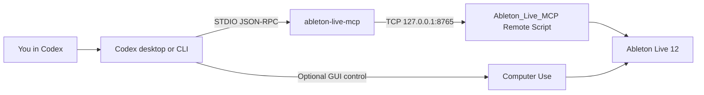

<!-- Global context: step-by-step Windows instructions for installing bschoepke/ableton-live-mcp for Codex desktop and CLI. -->

# Set up Ableton Live MCP for Codex

Use this repository to install the exact reviewed
[`bschoepke/ableton-live-mcp`](https://github.com/bschoepke/ableton-live-mcp)
checkout on Windows, add its Remote Script to Ableton Live, and register all 37
tools globally for Codex desktop and CLI.

Follow the steps below in order. Windows 11 with Ableton Live 12 is the verified
configuration. Upstream also documents macOS support, but these automation
scripts are currently verified on Windows only.

## Requirements

Install these before starting:

- Windows 11
- Ableton Live 12
- Codex desktop and Codex CLI
- PowerShell 7
- Git
- [`uv`](https://docs.astral.sh/uv/getting-started/installation/)

Make sure Ableton's User Library is enabled. The installer normally discovers it
under `Documents/Ableton/User Library`; you can provide another location in
`.env` if needed.

## What the setup connects



Computer Use is useful for visible settings, dialogs, and screenshots. The MCP
connection itself works without Computer Use.

## 1. Save your Ableton work

Save and back up important Live Sets, then close Ableton Live before installing
the Remote Script.

Do not automate save, recovery, crash, or update dialogs. If Live shows one
during setup, handle it yourself and never discard work just to continue.

> [!CAUTION]
> The default setup exposes all 37 tools and auto-approves MCP calls. Some tools
> can execute Python inside Live or change the open set. Use an empty/default set
> for the first test. Choose `--approval-mode prompt` or
> `--approval-mode writes` if you want Codex to ask before tool calls.

## 2. Clone this setup repository

Open PowerShell 7:

```powershell
git clone https://github.com/BurnyCoder/codex-ableton-live-mcp-setup.git
Set-Location codex-ableton-live-mcp-setup
git status --short
```

`git status --short` should print nothing.

## 3. Create the local environment

```powershell
uv sync --locked
```

This creates the repository-local `.venv` and installs the locked setup
dependencies.

## 4. Review configuration

```powershell
Copy-Item .env.example .env
notepad .env
```

The defaults work for a standard Windows installation. Uncomment only the
values you need to change:

| Variable | Default or purpose |
|---|---|
| `ABLETON_SETUP_CHECKOUT` | `%USERPROFILE%/Documents/Codex/MCP/ableton-live-mcp` |
| `ABLETON_USER_LIBRARY` | Auto-detected Ableton User Library |
| `ABLETON_SETUP_PYTHON` | `3.14` |
| `ABLETON_MCP_PORT` | `8765` |
| `CODEX_MCP_SERVER_NAME` | `ableton-live-mcp` |
| `CODEX_MCP_STARTUP_TIMEOUT_SEC` | `30` |
| `CODEX_MCP_TOOL_TIMEOUT_SEC` | `120` |
| `CODEX_MCP_APPROVAL_MODE` | `approve` |

Configuration precedence is command arguments, `.env`, automatic discovery,
then defaults. The host is fixed to `127.0.0.1`, the Remote Script folder is
fixed to `Ableton_Live_MCP`, and Python I/O uses UTF-8.

Do not put credentials or tokens in `.env`.

## 5. Check the computer

```powershell
.\manage.ps1 doctor
.\manage.ps1 doctor --json
```

Before continuing, confirm:

- Git, `uv`, Python 3.14, and Codex are available;
- one Ableton User Library was found;
- the upstream checkout destination is writable;
- port 8765 is free;
- any existing `AbletonMCP` integration is reported but not modified.

## 6. Preview the installation

For the standard all-tools setup:

```powershell
.\manage.ps1 install --dry-run --accept-risk
```

For prompts before write-capable tool calls:

```powershell
.\manage.ps1 install --dry-run --approval-mode writes
```

The supported approval modes are `auto`, `prompt`, `writes`, and
`approve`. Only `approve` requires `--accept-risk`.

Review every printed path. A dry run does not clone, install, edit Codex
configuration, or move files.

## 7. Install Ableton Live MCP

Standard all-tools setup:

```powershell
.\manage.ps1 install --accept-risk
```

The installer:

1. clones `bschoepke/ableton-live-mcp` at the reviewed source pins;
2. verifies the exact commit, parent, and tree before installation;
3. creates a separate Python 3.14 `.venv` inside the upstream checkout;
4. installs that checkout editable with `.[dev]` and never installs the
   unrelated identically named PyPI package;
5. writes the loopback runtime configuration;
6. preserves and hashes an existing `AbletonMCP` directory, if present;
7. installs `Ableton_Live_MCP` beside it on port 8765;
8. backs up `~/.codex/config.toml`;
9. registers the global Codex MCP entry with 30/120-second timeouts and your
   selected approval mode;
10. runs the upstream tests and STDIO protocol checks.

The exact source pins are stored in
[`config/versions.json`](config/versions.json).

## 8. Validate before opening Live

```powershell
.\manage.ps1 validate pre-live
.\manage.ps1 validate pre-live --json
```

This checks the installed Remote Script, visual-capture dependencies, 37 tool
schemas, Unicode handling, LF-only framing, and malformed-JSON recovery without
requiring a running Live process.

## 9. Activate the Remote Script in Ableton Live

1. Start Ableton Live.
2. Finish any Live update or recovery dialog yourself.
3. Open **Settings → Link, Tempo & MIDI**.
4. Add **Ableton Live MCP** as another Control Surface.
5. Set its **Input** to **None**.
6. Set its **Output** to **None**.
7. Leave an existing `AbletonMCP` Control Surface unchanged.
8. Restart Live once more if the new Control Surface does not load immediately.

The new bridge listens only on `127.0.0.1:8765`. A pre-existing
`AbletonMCP` integration may continue using port 9877.

## 10. Enable Computer Use in Codex desktop

These steps follow the current
[official OpenAI Computer Use instructions](https://learn.chatgpt.com/docs/computer-use):

1. Open Codex desktop.
2. Press **Ctrl+,** to open Settings. If the shortcut differs in your build, use
   the app's Settings menu.
3. Open **Plugins → Computer Use**.
4. Select **Install plugin** if offered.
5. Select **Enable** if offered.
6. Turn on both the **Computer Use server** and **Computer Use skill** toggles.
7. Select **Try now**.
8. Open **Settings → Computer use** and review app access.
9. Keep Ableton visible on the active Windows desktop.
10. When Codex first requests access to Ableton, inspect the displayed app and
    approve it. Choose **Always allow** only if you want future tasks to control
    that same app without another prompt.

Computer Use app approval is separate from Ableton MCP tool approval. Enabling
one does not grant the other. The setup command detects Computer Use status but
does not install the plugin or change these settings automatically.

## 11. Restart Codex and verify registration

Exit and reopen Codex desktop so it reloads the MCP configuration, then run:

```powershell
codex mcp list
codex mcp get ableton-live-mcp --json
```

The MCP server should appear as `ableton-live-mcp`. In Codex desktop, it should
also appear under MCP servers after the restart.

## 12. Validate the live connection

Open an empty/default Live Set and run:

```powershell
.\manage.ps1 validate post-live
.\manage.ps1 validate post-live --json
```

A complete result requires:

- listener 8765 is available;
- installed and runtime files are current;
- `runtime_current: true`;
- `live_mutations_safe: true`;
- visual dependencies work;
- an Ableton-only capture is nonblank;
- recent Live logs contain no Remote Script or Python startup error.

Then open a fresh Codex task and ask:

```text
Use the Ableton Live MCP read-only tools to call live_ping and
live_set_summary. Do not change the Live Set.
```

## Useful commands

| Command | Purpose |
|---|---|
| `.\manage.ps1 doctor` | Check prerequisites and discovered paths without changing anything. |
| `.\manage.ps1 install --accept-risk` | Install the pinned upstream checkout, Remote Script, and global Codex entry. |
| `.\manage.ps1 validate pre-live` | Check the installation without requiring Live. |
| `.\manage.ps1 validate post-live` | Check the running Live bridge and visual capture. |
| `.\manage.ps1 update --dry-run --accept-risk` | Preview an update. |
| `.\manage.ps1 update --accept-risk` | Test and install the reviewed version pins. |
| `.\manage.ps1 rollback --dry-run` | Preview rollback. |
| `.\manage.ps1 rollback` | Restore only the managed Codex section and move the managed Remote Script to a timestamped backup. |

## Ableton Live edition note

All 37 tools remain visible with the standard profile. Ableton's
[edition comparison](https://www.ableton.com/en/live/compare-editions/) shows
that Max for Live is unavailable in Intro and Standard. AgentAudioTap, generated
M4L devices, M4L cleanup, and Max Console tools may therefore fail on those
editions. Core Live tools and `live_visual_capture` do not require a custom Max
for Live device.

## Troubleshooting

- **Port 8765 is already in use:** close the conflicting process or choose
  another port before installing.
- **No User Library is found:** set `ABLETON_USER_LIBRARY` in `.env` to its
  exact path.
- **Ableton Live MCP is absent from Control Surfaces:** confirm
  `Ableton_Live_MCP` exists under the User Library's `Remote Scripts`
  directory, then restart Live.
- **Codex does not show the MCP:** restart Codex desktop, then run
  `codex mcp get ableton-live-mcp --json`.
- **Computer Use cannot see Ableton:** keep Live visible on the active Windows
  desktop and review **Settings → Computer use**.
- **Live shows a save, recovery, or update dialog:** stop automation and handle
  the dialog yourself.

See [Troubleshooting](docs/troubleshooting.md) for additional cases.

## Detailed guides

- [Prerequisites](docs/prerequisites.md)
- [Complete Windows installation](docs/installation.md)
- [Codex desktop and Computer Use](docs/codex-desktop.md)
- [Ableton activation](docs/ableton-activation.md)
- [Validation](docs/validation.md)
- [Security and approvals](docs/security.md)
- [Updates and rollback](docs/updates-and-rollback.md)

## License

The setup automation and documentation are MIT-licensed. The upstream Ableton
Live MCP remains a separate MIT-licensed project and is downloaded from its
reviewed Git commit rather than copied into this repository. See
[`THIRD_PARTY_NOTICES.md`](THIRD_PARTY_NOTICES.md).
