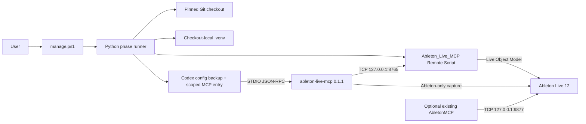

<!-- Global context: public entry point for a reproducible, safety-conscious Windows setup of bschoepke/ableton-live-mcp for Codex. -->

# Codex + Ableton Live MCP setup

Reproducible Windows automation and validation for connecting the exact
[`bschoepke/ableton-live-mcp`](https://github.com/bschoepke/ableton-live-mcp)
source reviewed by this project to Codex desktop and CLI.

Windows 11 is the verified target. The upstream project describes macOS support,
but this companion repository does not claim to have validated it.

## Methodology

This project treats setup as a staged, fail-closed experiment rather than a blind
installer:

1. inspect prerequisites and resolve configuration without changing the machine;
2. fetch a pinned upstream base and the exact reviewed Windows STDIO fix;
3. verify commit, parent, and tree identities before installing anything;
4. build an isolated Python 3.14 environment with `uv` and install the checkout
   editable—never the unrelated package that happens to have the same PyPI name;
5. install the Remote Script beside any existing `AbletonMCP` integration;
6. back up and surgically update Codex configuration;
7. stop at a human-controlled Live restart and Control Surface checkpoint;
8. validate offline, then read-only against Live, then from a fresh Codex process;
9. retain timestamped local logs while publishing only sanitized results.

This is a systems-integration project: it trains or fine-tunes no model, uses no
training dataset, and the MCP server itself invokes no LLM. Evaluation consists
of source-identity checks, unit and upstream tests, JSON-RPC protocol probes,
read-only Live runtime checks, visual evidence, and a fresh Codex client check.

The pinned source identities and expected test results live in
[`config/versions.json`](config/versions.json). Changing a pin is a reviewed
upgrade, not an incidental install action.



## Safety warning: read before installing

> [!CAUTION]
> The standard profile exposes all 37 upstream tools and sets
> `default_tools_approval_mode = "approve"`. It therefore skips per-tool Codex
> prompts, including for tools that can execute arbitrary Python inside Live and
> mutate or corrupt a Live Set. `install` and `update` refuse this profile unless
> you pass `--accept-risk`.

Before installation:

- save and independently back up important Live Sets;
- use an empty/default set for first validation;
- review generated actions before asking an agent to mutate Live;
- never let the old and new agent integrations mutate one set concurrently;
- remember that loopback-only networking prevents remote network access, but not
  access by other processes running on the same Windows account;
- choose `--approval-mode prompt` or `--approval-mode writes` if global
  auto-approval is not appropriate for your threat model.

Read the [operator security guide](docs/security.md) before using write tools.

## Verified baseline

The sanitized 2026-08-11 experiment used Windows 11, Python 3.14.2, `uv` 0.11.27,
Codex CLI 0.144.6, and Live 12 Intro 12.3.6. It observed:

| Check | Result |
|---|---|
| Pinned upstream base | `70f7df9192b78d9bd9405f369c9e046c88f1610e` |
| Reviewed Windows PR #15 commit | `a93d223440b275feda2fb08cdf814238c1270e00` |
| Expected patched tree | `2d97d0b270f4d9058e2fd624af7e3b769e3493bd` |
| Upstream tests | 285 passed; only the two documented PR #14 path assertions failed |
| STDIO protocol | 37 unique schemas, UTF-8 round trip, LF framing, parse-error recovery |
| Live runtime | current files, `runtime_current: true`, `live_mutations_safe: true` |
| Visual validation | nonblank Ableton-only capture on Windows |
| Fresh Codex client | read-only `live_ping` and `live_set_summary` succeeded |

See the [full sanitized experiment](reports/experiments/2026-08-11-windows-baseline.md).
Those results describe one tested system, not a guarantee for every Live version
or hardware configuration.

## Quick start

Use PowerShell 7 in a directory where you want this companion repository:

```powershell
git clone https://github.com/BurnyCoder/codex-ableton-live-mcp-setup.git
Set-Location codex-ableton-live-mcp-setup
uv sync --locked
Copy-Item .env.example .env
.\manage.ps1 doctor
.\manage.ps1 install --dry-run --accept-risk
.\manage.ps1 install --accept-risk
.\manage.ps1 validate pre-live
```

The standard install deliberately pauses before Live activation. Save your work,
restart Live yourself, and add **Ableton Live MCP** as a second Control Surface
with Input and Output set to **None**. Then run:

```powershell
.\manage.ps1 validate post-live
```

Finally, restart Codex desktop so the running client reloads the shared MCP
configuration. Complete instructions—including the optional Computer Use plugin—
are in the [Windows installation guide](docs/installation.md).

## What the commands do

| Command | Behavior |
|---|---|
| `.\manage.ps1 doctor` | Read-only prerequisite, discovery, port, Codex, and Computer Use diagnostics. |
| `.\manage.ps1 install --accept-risk` | Pinned acquisition, environment, Remote Script, backup, and Codex registration phases. |
| `.\manage.ps1 validate pre-live` | Recheck Remote Script currency, visual dependencies, and STDIO behavior without requiring Live; install/update already ran the full upstream tests. |
| `.\manage.ps1 validate post-live` | Listener, runtime freshness, mutation-safety, visual, and recent Live-log checks. |
| `.\manage.ps1 update --accept-risk` | Clean-checkout, repin-aware test-and-reinstall workflow using the same safety checkpoint. |
| `.\manage.ps1 rollback` | Restore only the managed Codex section and move the managed Remote Script to a timestamped backup. |

Every mutating command supports `--dry-run`. `doctor` and both validation modes
support `--json` for machine-readable output. Commands stream timestamped output
to the terminal and an ignored local log without truncating subprocess output.

## Configuration

Precedence is command arguments, `.env`, automatic discovery, then defaults.
The fixed privacy/safety values are `127.0.0.1`, `Ableton_Live_MCP`, and UTF-8
Python I/O. Defaults include:

| Setting | Default |
|---|---|
| Upstream checkout | `%USERPROFILE%/Documents/Codex/MCP/ableton-live-mcp` |
| Python | `3.14` |
| New bridge port | `8765` |
| Startup / tool timeout | 30 / 120 seconds |
| Approval mode | `approve` |
| Tool filters | omitted—all 37 tools exposed |

Review [`.env.example`](.env.example) before installing. Forward slashes are used
inside generated `.env` and TOML values so paths with spaces remain portable
through the Windows/Python/Max boundary.

## Important edition limitation

All 37 tools remain visible under the standard profile. Ableton's current
[edition comparison](https://www.ableton.com/en/live/compare-editions/) shows
that Max for Live is unavailable in Intro and Standard. On those editions,
AgentAudioTap, generated M4L device, M4L cleanup, and Max Console tools may fail
even though they are exposed and auto-approved. Core Live tools and
`live_visual_capture` do not depend on custom Max for Live devices.

## Documentation map

- [Prerequisites](docs/prerequisites.md)
- [Complete Windows installation](docs/installation.md)
- [Codex desktop and Computer Use](docs/codex-desktop.md)
- [Live activation checkpoint](docs/ableton-activation.md)
- [Validation and acceptance criteria](docs/validation.md)
- [Troubleshooting](docs/troubleshooting.md)
- [Security model](docs/security.md)
- [Updates and rollback](docs/updates-and-rollback.md)
- [Manual release checklist](docs/release-checklist.md)
- [Primary source index](docs/sources.md)
- [Experiment index](reports/experiments.md)

## License and independence

Original companion automation and documentation are MIT-licensed. The upstream
Ableton Live MCP remains a separate MIT-licensed project and is fetched at
install time; it is not vendored here. See
[`THIRD_PARTY_NOTICES.md`](THIRD_PARTY_NOTICES.md).

Ableton, Live, Codex, ChatGPT, GitHub, Python, and `uv` are names or trademarks of
their respective owners. This project is not affiliated with or supported by
Ableton, OpenAI, GitHub, the Python Software Foundation, or Astral.
