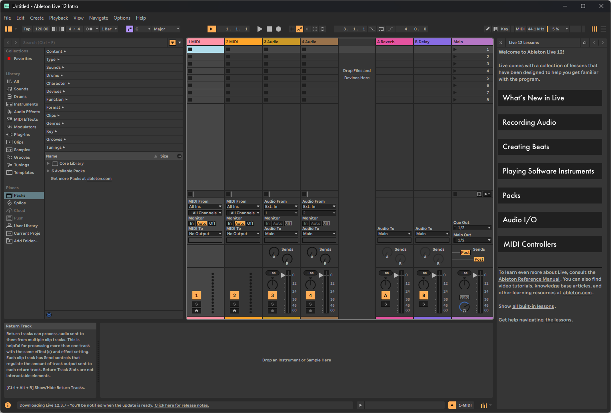

<!-- Global context: sanitized scientific-method record of the original Windows installation and read-only end-to-end validation. -->

# Windows baseline: pinned Ableton Live MCP with Codex

**Experiment date:** 2026-08-11  
**Status:** Passed within the stated scope  
**Scope:** Windows installation, coexistence, offline/protocol checks, read-only
Live validation, Ableton-only capture, and fresh Codex client verification

## Domain and question

The domain is reliable local Model Context Protocol integration with a digital
audio workstation on Windows.

No model was trained or fine-tuned, no training dataset was used, and the MCP
server invoked no LLM. The experimental subject was a pinned software
integration; its evaluation data consisted of test results, protocol responses,
runtime status, sanitized logs, and an inspected default-set capture.

Question: can a pinned `bschoepke/ableton-live-mcp` base plus a reviewed Windows
STDIO fix be installed through an isolated Python environment, coexist with an
older Ableton MCP integration, expose 37 valid tools to Codex, and pass read-only
runtime/visual validation without modifying the older integration or a user's
creative work?

## Existing information

- Upstream warns that the MCP can edit or corrupt Live Sets and can evaluate
  general Python through Live's object model.
- Upstream setup installs a Python package, a User Library Remote Script, a Live
  Control Surface, and an MCP STDIO command.
- PR #14 reports two Windows-only test assertions caused by comparing raw
  backslashes with production forward-slash Max paths.
- PR #15 reports Windows pipe corruption for non-ASCII content, CRLF framing, and
  process death after malformed JSON.
- OpenAI documents shared local MCP configuration across Codex desktop, CLI, and
  IDE, plus server-wide tool approval modes.
- Ableton documents User Library `Remote Scripts` installation and shows Max for
  Live unavailable in Intro.

## Hypotheses

1. The reviewed base with the exact PR #15 content will preserve UTF-8, emit
   LF-only JSON records, recover after malformed input, and expose 37 schemas.
2. The full upstream suite will have no failures other than exactly the two PR
   #14 Windows assertion defects; deselecting only those will leave all remaining
   tests passing.
3. The new `Ableton_Live_MCP` listener can coexist with an existing `AbletonMCP`
   listener when installed on a different loopback port.
4. Installed-file checks plus runtime markers can prove that Live loaded current
   code and is safe for subsequent mutation, without performing a mutation.
5. A fresh Codex process using the global allow-all configuration can complete
   `live_ping` and `live_set_summary` read-only.

## Materials and controlled configuration

| Component | Value |
|---|---|
| Operating system | Windows 11 |
| Python | 3.14.2, checkout-local virtual environment |
| `uv` | 0.11.27 |
| Codex CLI | 0.144.6 |
| Ableton Live | Live 12 Intro 12.3.6 |
| Upstream package | `ableton-live-mcp` 0.1.1, editable from Git checkout |
| Base commit | `70f7df9192b78d9bd9405f369c9e046c88f1610e` |
| PR #15 commit | `a93d223440b275feda2fb08cdf814238c1270e00` |
| Expected patched tree | `2d97d0b270f4d9058e2fd624af7e3b769e3493bd` |
| New bridge | `127.0.0.1:8765` |
| Existing bridge | `127.0.0.1:9877` |
| Codex policy | all 37 tools exposed; server approval mode `approve` |

The tested set was Live's default/untitled set. No destructive regression, custom
Max for Live installation, set save, or creative-content mutation was authorized.
Live API checks were run sequentially.

## Method

1. Verify the upstream remote, base commit, PR #15 commit relationship, and final
   patched tree.
2. Create a local Python 3.14 environment with `uv`; install the checkout editable
   with `.[dev]`.
3. Write non-secret runtime configuration for loopback, port 8765, the discovered
   User Library, and UTF-8 I/O.
4. Hash the pre-existing `AbletonMCP` directory.
5. Install `Ableton_Live_MCP` idempotently with update semantics; repeat once to
   test current-state behavior.
6. Back up Codex configuration and add a scoped STDIO server entry with 30-second
   startup, 120-second tool timeout, `required=false`, no tool filters, and
   approval mode `approve`.
7. Run the full upstream suite, then the suite deselecting exactly the two PR #14
   node IDs.
8. Run upstream validation without Live.
9. Drive the STDIO server directly: initialize, list tools, validate schemas,
   round-trip a non-ASCII sentinel, inspect newline bytes, send malformed JSON,
   and send a valid request afterward.
10. Restart Live under user control, select the new script as a second Control
    Surface with Input/Output `None`, and leave the old surface unchanged.
11. Run the full validator and listener checks; capture only the Ableton window;
    inspect the recent Live log for relevant startup errors.
12. Start a fresh Codex process and call only `live_ping` and
    `live_set_summary`; compare the older integration hash with its initial value.

## Observations

| Observation | Result |
|---|---|
| Source identity | Base and PR #15 content matched; final tree matched the expected public tree. |
| Editable install | Package 0.1.1 loaded from the verified checkout; no bare PyPI install was used. |
| Idempotent Remote Script install | Second update reported current state. |
| Existing integration | Pre/post inventory matched; its folder and port were preserved. |
| Complete upstream suite | 287 collected: 285 passed, exactly two PR #14 path assertions failed. |
| Deselect-exactly-known run | 285 passed, 2 deselected. |
| Pre-Live validator | Passed; installed script current and visual dependencies available. |
| Tool schemas | 37 unique tools, each with a valid object input schema. |
| Windows STDIO | Non-ASCII round trip passed; records used bare LF. |
| Malformed input | Returned JSON-RPC `-32700`; subsequent valid request succeeded. |
| New Live listener | Port 8765 was owned by the Live process. |
| Existing listener | Port 9877 remained owned by the Live process. |
| Runtime validator | Exit zero; `runtime_current: true`; `live_mutations_safe: true`; installed files current. |
| Visual check | 1528×1033 Ableton-only PNG was nonblank and visually showed the default Live window. |
| Recent Live log | New script reported listener 8765; both surfaces had Input/Output `None`; no relevant Remote Script/Python error match. |
| Fresh Codex process | `live_ping` succeeded; `live_set_summary` reported 4 tracks, 8 scenes, and 120 BPM without mutation. |
| Global approval policy | Fresh process completed `live_ping` without temporary approval overrides. |

## Analysis and interpretation

All five hypotheses were supported in the observed environment.

The PR #15 content addressed failures at the transport boundary rather than Live
business logic: Unicode integrity, record framing, and process resilience all
passed direct byte/protocol checks. Exact tree verification was important because
a locally cherry-picked commit can have a different local commit ID while
retaining the reviewed content.

The two full-suite failures matched PR #14 exactly, and all remaining tests passed
when only those nodes were deselected. Their expected/actual difference was path
representation in assertions; production deliberately uses forward slashes for
Max. The experiment therefore classified them as upstream test portability
defects, not ignored production failures.

Coexistence was supported by distinct loopback ports and unchanged old-integration
inventory. This does not establish that concurrent mutation is safe; operational
policy still permits only one integration to mutate at a time.

Runtime and visual evidence added information unavailable from source tests. The
validator proved Live loaded current code, while the nonblank Ableton-only capture
showed the expected application without exposing a general desktop screenshot.

### Sanitized visual evidence



The published PNG is the inspected 1528×1033 Ableton-only capture. Its SHA-256 is
`299edcb2d15286e6f4618d2b8b339dc3cfc7156b289f956dee6e027d08d4f24a`;
the repository safety check inspects textual PNG metadata for private path and
credential signatures.

## Limitations and possible confounders

- One Windows 11 machine and one Live patch version were observed.
- Live Intro cannot load arbitrary custom Max for Live devices, so M4L tool
  behavior was not tested even though all schemas were exposed.
- PR #15 and PR #14 were open upstream changes at experiment time.
- The reviewed upstream commit has no lockfile; its `.[dev]` dependency versions
  are constrained by upstream metadata but can resolve differently over time.
- The test used a default set; large sets, third-party plugins, active playback,
  or modal dialogs may change responsiveness.
- The acceptance run intentionally excluded destructive mutations, set saving,
  and rollback of already-applied Live content.
- Computer Use was not required to establish MCP transport correctness.
- A successful allow-all read call proves policy loading, not the safety of
  future auto-approved write calls.

## Conclusion and refined hypothesis

Conclusion: the exact pinned source and Windows transport fix produced a
functioning, current, visually verifiable Codex-to-Live bridge on the tested
Windows system while preserving an older integration. The evidence supports a
Windows-first reproducible guide with strict identity, staged validation, and a
human Live checkpoint.

Refined hypothesis: on another Windows 11 account with Live 12 and no existing
integration, the same manifest and staged procedure should reproduce the offline,
STDIO, runtime, visual, and fresh-client results; differences should be confined
to discovered paths, versions, and the optional 9877 coexistence check.

## Reproduction

```powershell
uv sync --locked
Copy-Item .env.example .env
.\manage.ps1 doctor --json
.\manage.ps1 install --dry-run --accept-risk
.\manage.ps1 install --accept-risk
.\manage.ps1 validate pre-live --json
# Complete the documented human Live checkpoint.
.\manage.ps1 validate post-live --json
```

Then restart Codex and use the repository's fresh-client read-only prompt.

## Evidence and privacy

The experiment retained complete timestamped local command/prompt/output logs,
configuration backups, structured results, and a capture. This public record
intentionally omits usernames, machine names, absolute personal paths, process
IDs, Live object IDs, set signatures, raw config, and private set content.

## Sources

See the repository's [primary source index](../../docs/sources.md), particularly
upstream [PR #15](https://github.com/bschoepke/ableton-live-mcp/pull/15),
[PR #14](https://github.com/bschoepke/ableton-live-mcp/pull/14), OpenAI's
[MCP documentation](https://learn.chatgpt.com/docs/extend/mcp?surface=cli), and
Ableton's [Remote Script instructions](https://help.ableton.com/hc/en-us/articles/209072009-Installing-third-party-remote-scripts).
